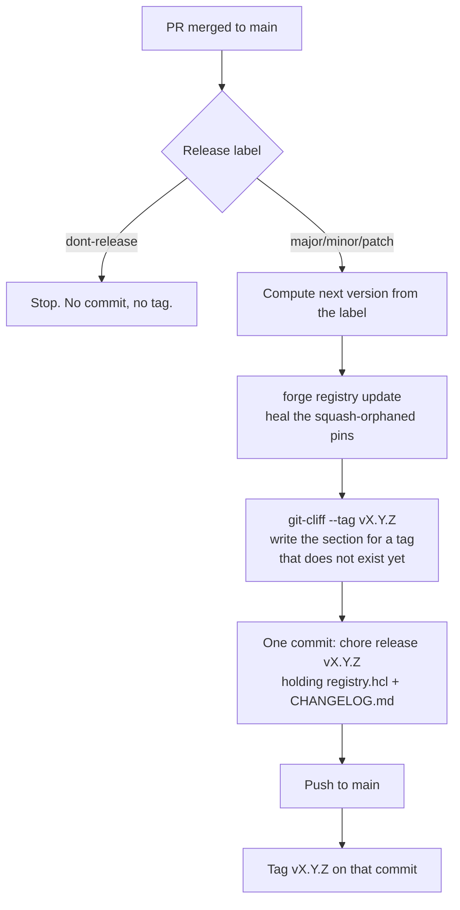

# Contributing

This registry holds blueprints that the
[forge](https://github.com/donaldgifford/forge) CLI reads to scaffold new
repositories. There is no application code to build. What needs care instead is
the contract with consumers: a blueprint is pinned by `version`, so changing one
without bumping it hands people different files under a version they already
resolved.

Two rules follow from that, and CI enforces both:

1. Touching a blueprint means bumping its `version`.
2. Every pull request carries exactly one release label.

## Branches and commits

Branch names are `<type>/<slug>` — `feat/`, `fix/`, `docs/`, `chore/`, `bug/`.
The branch prefix is what the labeler reads to apply the topic label.

Pull request titles must be
[conventional commits](https://www.conventionalcommits.org/en/v1.0.0/). This is
not cosmetic. The repository squash-merges, so the PR title becomes the commit
subject on `main`, and that subject is the only thing `git-cliff` sees when it
writes the changelog. A title of "fix stuff" produces a changelog entry reading
"fix stuff" forever.

Scopes are optional but meaningful. A scope of `<category>/<name>` routes the
entry into its own **Blueprint Changes** section, ahead of the generic type
sections:

```text
feat(go/k8s): add a Helm chart values schema
fix(bun/std): correct the vitest config path
docs(inv-0003): add blast-radius addendum
chore(deps): bump actions/checkout
```

Only `bun`, `go`, `homelab`, `rust`, and `std` are accepted as the category
half. Anything else is read as an ordinary scope.

## Release labels

Every pull request needs exactly one of these. The release job reads the label
off the merged PR to decide what to tag.

| Label          | Effect on merge                          |
| -------------- | ---------------------------------------- |
| `major`        | `vX.y.z` → `v(X+1).0.0`                  |
| `minor`        | `vx.Y.z` → `vx.(Y+1).0`                  |
| `patch`        | `vx.y.Z` → `vx.y.(Z+1)`                  |
| `dont-release` | No tag, no release commit, nothing moves |

Documentation-only changes take `dont-release`. A blueprint change must not —
the version gate rejects a blueprint edit that arrives with `dont-release`,
because consumers would be left with a mutated blueprint at an unchanged
version.

Dependabot is a special case. It labels its own pull requests `major`, `minor`,
or `patch` to describe what the _dependency_ did, which collides with what those
labels mean here. A workflow rewrites that to `patch` when the PR opens, since a
dependency bump inside a blueprint is almost always a patch to the registry.
Relabel by hand afterwards if it deserves more; the rewrite only fires on open
and reopen, so it will stick.

## Changing a blueprint

Edit the files, then bump the version:

```bash
scripts/bump-blueprint.sh go/k8s patch
```

The helper rewrites the `version` field in place, preserving the surrounding
alignment. Pick the level by what a consumer would notice: a new variable or
template file is `minor`, a corrected typo or dependency bump is `patch`, and
anything that changes required variables or removes files is `major`.

Two things are worth knowing about what counts as "a blueprint change":

- Editing a shared default counts for everything that inherits it. A change
  under `_defaults/` at the registry root fans out to all 19 blueprints, and all
  19 need a bump. A change under `go/_defaults/` fans out to the Go blueprints
  only.
- `registry.hcl` is not yours to edit. The release job regenerates it. See
  below.

Run the gate locally before pushing to see what it will ask for:

```bash
scripts/check-blueprint-bump.sh
```

## Do not run `forge registry update`

This used to be a step contributors performed by hand, and it is now actively
unhelpful. `registry.hcl` pins each blueprint to a `latest_commit`, and a
squash-merge rewrites the commit the pin was computed from, so any pin written
on a branch is stale the moment the PR lands. The release job runs
`forge registry update` after the squash, on `main`, where the commits are the
real ones.

Leave `registry.hcl` alone. If a diff shows it changed, drop that change.

The same applies to `CHANGELOG.md`. It is written once per release by
`git-cliff`, inside the release commit. Pull requests do not touch it.

## What happens when a PR merges



The ordering is the point. The tag lands on a commit that already contains both
the healed pins and the changelog section describing itself. Checking out
`vX.Y.Z` gives you a registry where `forge registry update --check` exits clean,
which was not true of the previous flow.

Pushes made with `GITHUB_TOKEN` do not start new workflow runs, so the release
commit cannot re-trigger the release job. A guard on the commit subject covers
the case of a release commit arriving some other way.

## Checks on a pull request

| Check                    | What it does                                        |
| ------------------------ | --------------------------------------------------- |
| `Label PR`               | Applies a topic label from the branch prefix        |
| `Check Required Labels`  | Fails unless exactly one release label is present   |
| `Blueprint Version Gate` | Fails if a touched blueprint has no `version` bump  |
| `PR Title Lint`          | Fails if the title is not a conventional commit     |
| `Script Tests`           | `shellcheck`, `shfmt -i 2 -ci`, and the bats suites |
| TruffleHog               | Scans the diff for verified and unknown secrets     |

Run the shell checks the way CI does:

```bash
shellcheck scripts/*.sh .github/actions/pr-semver-tag/entrypoint.sh
shfmt -d -i 2 -ci scripts/*.sh .github/actions/pr-semver-tag/entrypoint.sh
bats scripts/test/ .github/actions/pr-semver-tag/test/
```

The config linters are **not** wired into CI — nothing fails a PR for
mis-wrapped Markdown or unformatted YAML today. Run them by hand:

```bash
yamllint .
markdownlint-cli2
prettier --check '**/*.md'
```

Both `prettier` and `markdownlint-cli2` currently report pre-existing failures
under `.claude/skills/`, so scope them to the files you touched rather than
reading a clean run as the baseline.

## Adding a blueprint

```bash
forge registry blueprint <category>/<name> --registry-dir .
```

Then define variables in `blueprint.hcl`, add `.tmpl` files, and lean on
`_defaults/` for anything shared. New blueprints still need a release label; a
new blueprint is a `minor` bump to the registry.

## Conventions that bite

- **Escape `${...}` meant for a downstream tool.** Goreleaser, Docker buildx
  ARGs, shell parameter expansion, and GitHub Actions expressions all use
  `${name}` as their own syntax. Write `$${name}` so HCL2 emits a literal.
  Forge's own variables use bare `${name}`.
- **Files without `.tmpl` are never parsed.** Copied through byte for byte.
- **`git_provider` is an object and objects replace wholesale.** Forge has no
  `optional()` for exact object types, so supplying the key at all means
  supplying all four attributes.
- **YAML needs a `---` document start** and two-space indentation.
- **Markdown prose wraps at 80 characters.**

Longer-form background lives in [docs/](docs/): architecture decisions in
`docs/adr/`, the release automation itself in
[IMPL-0004](docs/impl/0004-registry-release-automation-pr-semver-tag-version-gate-and.md),
and the investigation that motivated it in
[INV-0002](docs/investigation/0002-ci-enforcement-of-blueprint-version-bumps-and-registry-sync.md).
